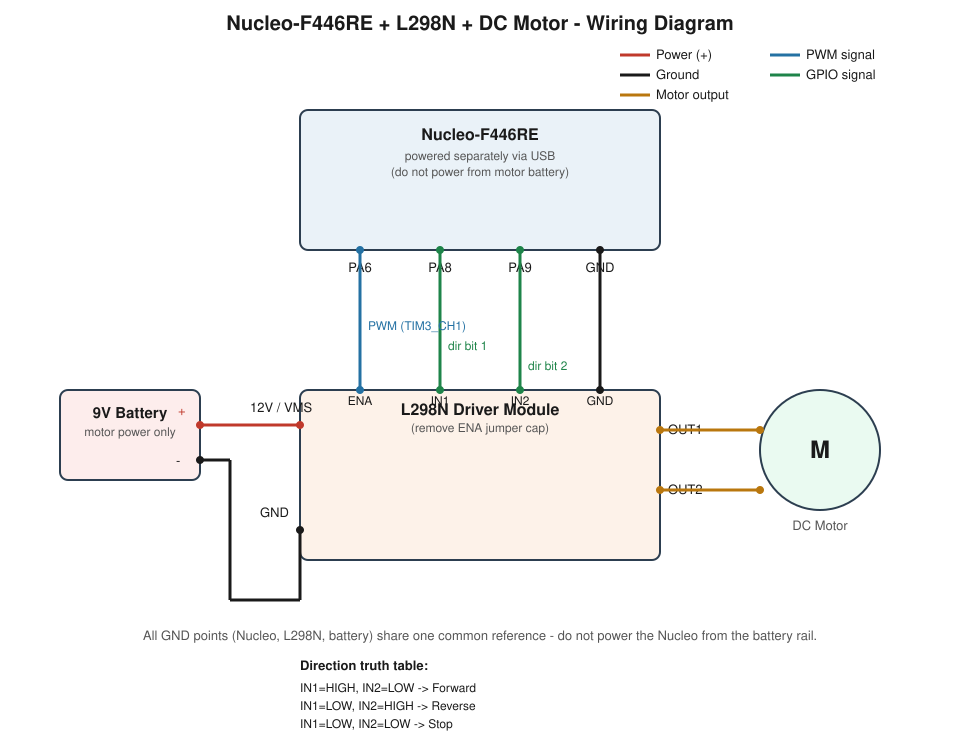

# STM32 Nucleo-F446RE + L298N DC Motor Control

Wiring reference and firmware for driving a single DC motor via PWM speed control and H-bridge direction control. Firmware is bare-metal (direct register access), not using HAL APIs.

## Hardware

- ST Nucleo-F446RE (STM32F446RE)
- L298N dual H-bridge motor driver module
- DC motor
- 9V battery (motor power) - see [Power Wiring](#power-wiring)

## Wiring Diagram

[Fritzing wiring diagram](doc/wiring_diagram_fritzing.png)

## Pin Connections

| L298N Pin | Nucleo Pin | Function                          |
|-----------|------------|------------------------------------|
| ENA       | PA6        | PWM output (TIM3_CH1) - speed control |
| IN1       | PA8        | GPIO output - direction control bit 1 |
| IN2       | PA9        | GPIO output - direction control bit 2 |
| GND       | GND        | Common ground (Nucleo + L298N + battery) |
| 12V / VMS | Battery +  | Motor power input (9V battery)     |
| OUT1      | -          | To DC motor terminal 1             |
| OUT2      | -          | To DC motor terminal 2             |

## Power Wiring

- **9V battery positive** → L298N `12V / VMS` input
- **9V battery negative (GND)** → tied to the same common ground as the Nucleo and L298N
- **Nucleo is powered separately** (e.g. via USB) - never connect the Nucleo's own supply to the motor's power rail
- All three grounds (battery, Nucleo, L298N) **must** share a single common reference point

## Notes

- Remove the L298N's **ENA jumper cap** if present - it forces the driver to always-full-speed and blocks PWM control on that channel.
- **Direction truth table**:
  | IN1  | IN2  | Result   |
  |------|------|----------|
  | HIGH | LOW  | Forward  |
  | LOW  | HIGH | Reverse  |
  | LOW  | LOW  | Stop     |
- A 9V battery has limited current capacity - expect possible voltage sag or reduced torque under load. Switch to a higher-capacity pack (e.g. 4–6x AA) if the motor struggles or the Nucleo resets under load.
